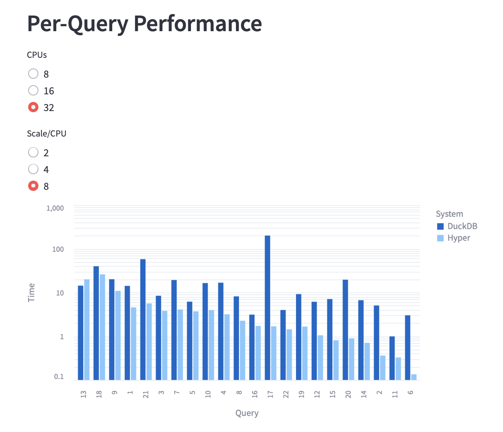
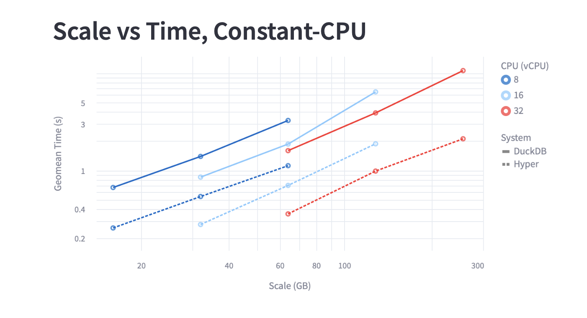
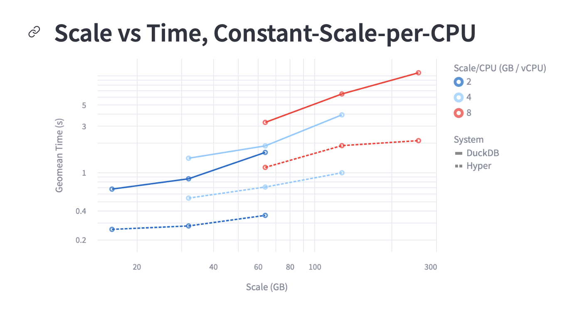

# Hyper vs DuckDB

I ran using Hyper and DuckDB on 3 system configurations:
- 8 cores, 32 GB memory (n2d-standard-8)
- 16 cores, 64 GB memory (n2d-standard-16)
- 32 cores, 128 GB memory (n2d-standard-32)

My benchmark was TPC-H, at 3 scales for each system configuration:
- Scale = CPU cores * 2 GB
- Scale = CPU cores * 4 GB
- Scale = CPU cores * 8 GB

You can see the results at https://hyper-vs-duckdb.streamlit.app or below:

